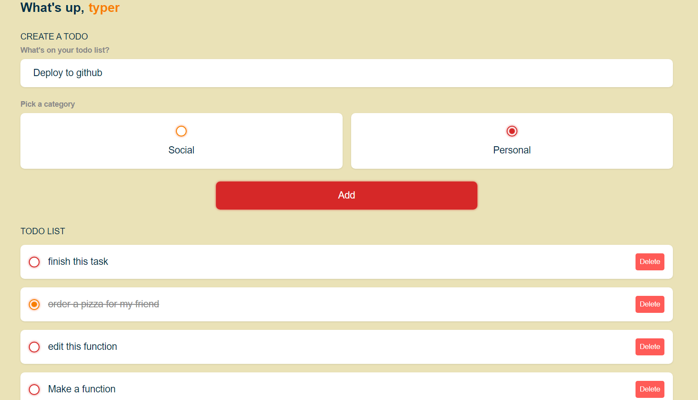

# A Vue 3 + Vite Todo App Project

</img>

1. Run project with


    ```
    npm run dev
    ```
    

 ## Small project i learn from youtube toturial to use storage 
 ### Down here you will find the youTube videos. [Video](https://www.youtube.com/watch?v=qhjxAP1hFuI).

This template should help get you started developing with Vue 3 in Vite. The template uses Vue 3 `<script setup>` SFCs, check out the [script setup docs](https://v3.vuejs.org/api/sfc-script-setup.html#sfc-script-setup) to learn more.

## Recommended IDE Setup

- [VS Code](https://code.visualstudio.com/) + [Volar](https://marketplace.visualstudio.com/items?itemName=Vue.volar)
